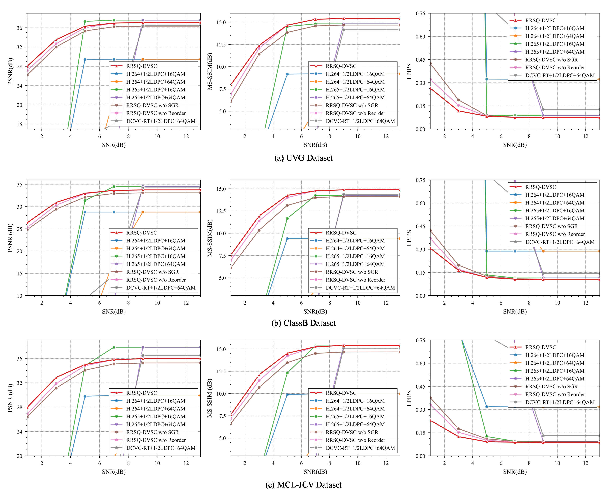

# 🚀 The implementation of paper "Semantic Space Reorganization for Robust Digital Video Semantic Communication"


## 📑 Abstract

<div style="background-color:#FFFFFF; padding:10px; border-radius:6px;">
Codebook-assisted semantic communication often suffers significant degradation in reconstruction quality and Quality-of-Service (QoS) due to index perturbations caused by unreliable channels. In this paper, we propose Reordered Residual Stochastic Quantization for robust Digital Video Semantic Communication (RRSQ-DVSC) from the perspective of semantic space organization. Specifically, We design a semantic-aware clustering algorithm to enlarge the distance between semantically disadjacent codewords and arrange semantically similar counterparts in close proximity. This approach effectively transforms index perturbations into bounded semantic distortions. Moreover, we propose a Semantic-Guided Reconstruction (SGR) module equipped with cross-window fusion attention to enhance inter-frame semantic consistency in long video sequences. Experimental results on the HEVC Class B dataset demonstrate that at an SNR of 1 dB, the proposed RRSQ-DVSC achieves improvements of 4.91\% in PSNR, 5.52\% in MS-SSIM, and 14.25\% in LPIPS over its counterpart without codebook reordering, validating its effectiveness for robust semantic video communication.
</div>


## 🖥️ Prerequisites
 - Python 3.12 and conda, get [Conda](https://www.anaconda.com/download).
 - CUDA 12.6 if you have a NVIDIA GPU, get [CUDA](https://developer.nvidia.com/cuda-downloads).
 - Environment setup:

```shell
conda create -n rrsq_digital_semantic_com python=3.12
conda activate rrsq_digital_semantic_com

pip install torch==2.8.0 torchvision==0.23.0 torchaudio==2.8.0 --index-url https://download.pytorch.org/whl/cu126

pip install -r requirements.txt
```


## 🗂️ Test Dataset

We support arbitrary original resolution. The input video resolution will be padded to 64x automatically. The reconstructed video will be cropped back to the original size. The distortion (PSNR/MS-SSIm/LPIPS) is computed at original resolution.

Put the `*.yuv` video files in the folder structure similar to the following structure.

```
data/HEVC/ClassB/
       |- BasketballDrive_1920x1080_50.yuv
       |- BQTerrace_1920x1080_50.yuv
       |-...
data/HEVC/ClassC/
       |- ...
...
```

> Note: May you need to change the data path in the `testcase.py` to your own path.


## 🗃️ Pre-trained Model 

The image and video model is placed in the `checkpoints` folder.


## 📊 Evaluation 




## 📜 Citation 
If you find our work useful in your research, please consider citing:

```
TBD.
```


## 🤝 Acknowledgement

Our research is based on [DCVC](https://github.com/microsoft/DCVC) and [Swin-Transformer](https://github.com/microsoft/Swin-Transformer). Thanks for their excellent work.

